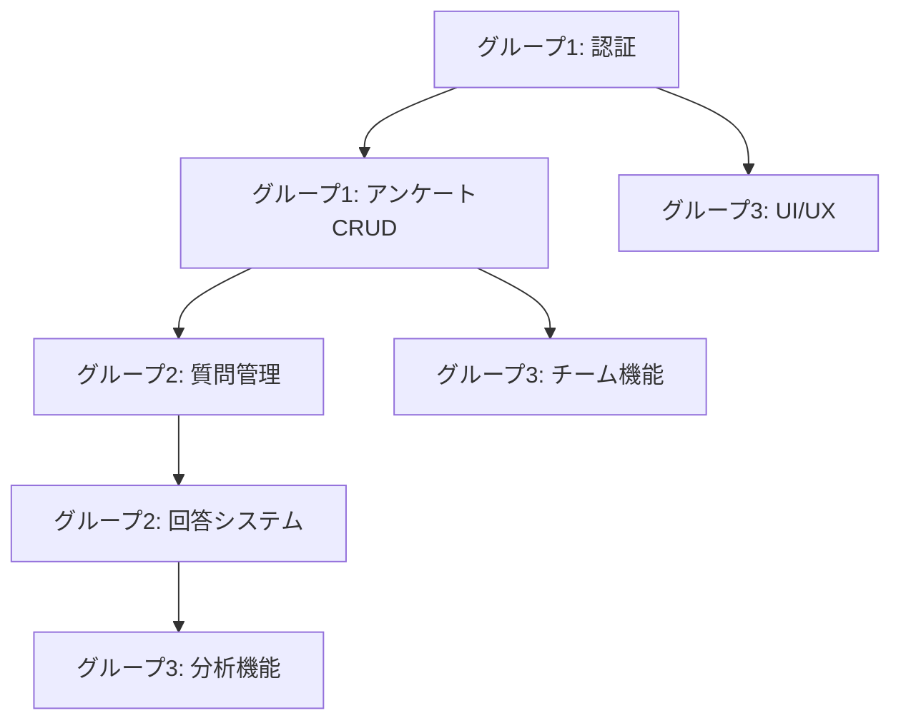

# デバッグ作業調整ガイド

## 3つのClaude Code並行作業の進め方

### 各グループの役割分担

| グループ | 担当範囲 | 優先度 | 依存関係 |
|---------|---------|--------|----------|
| **グループ1** | 認証・アンケート基本機能 | 最高 | なし（基盤） |
| **グループ2** | 質問・回答システム | 高 | グループ1の完了後 |
| **グループ3** | 分析・拡張機能 | 中 | グループ1,2の基本機能後 |

### 作業開始前の準備

#### 全グループ共通
1. **環境セットアップ**
   ```bash
   # 依存関係のインストール
   npm install
   
   # 環境変数の確認
   cat .env.local
   
   # 開発サーバーの起動
   npm run dev
   ```

2. **ブランチ作成**
   ```bash
   # グループ1
   git checkout -b debug/group1-auth-surveys
   
   # グループ2
   git checkout -b debug/group2-questions-responses
   
   # グループ3
   git checkout -b debug/group3-analytics-ui
   ```

3. **テストアカウント確認**
   - test@example.com / Test1234!
   - admin@example.com / Test1234!
   - viewer@example.com / Test1234!

### 作業の優先順位

#### 即座に開始可能
- **グループ1**: 認証機能のテスト
- **グループ3**: UI/UXテーマの確認

#### グループ1完了後に開始
- **グループ2**: 質問管理機能（アンケートIDが必要）
- **グループ3**: チーム機能（認証が必要）

#### グループ1,2完了後に開始
- **グループ2**: 回答システム（質問が必要）
- **グループ3**: 分析機能（回答データが必要）

### コミュニケーション方法

#### 進捗報告
各グループは作業開始時と完了時に`DEVELOPMENT_LOG.md`に記録：

```markdown
### [グループX] [時刻] - [作業内容]
- **開始/完了**: 
- **担当機能**: 
- **状況**: 
- **次の作業**: 
```

#### 問題発生時
1. エラー内容を`DEBUG_ISSUES.md`に記録
2. 他グループへの影響を評価
3. 必要に応じて作業を調整

### 依存関係の管理



### 共有リソース

#### データベース
- 各グループでテストデータを作成
- プレフィックスを使用して区別
  - G1_テストアンケート
  - G2_質問テスト
  - G3_分析テスト

#### コンポーネント
- 修正時は影響範囲を確認
- 大きな変更は他グループに通知

### マージ戦略

1. **日次マージ**
   - 毎日終了時に各ブランチの変更を確認
   - コンフリクトを早期発見

2. **マージ順序**
   ```
   main <- debug/group1-auth-surveys
        <- debug/group2-questions-responses
        <- debug/group3-analytics-ui
   ```

3. **マージ前チェック**
   - [ ] テストが通る
   - [ ] エラーログがクリーン
   - [ ] 他グループへの影響なし

### トラブルシューティング

#### ポート競合
```bash
# グループ1: 3000
# グループ2: 3001
# グループ3: 3002
PORT=3001 npm run dev
```

#### データベース競合
- 各グループで異なるテストユーザーを使用
- 共有データは読み取り専用で扱う

### 完了条件

#### 個別完了
- 各グループのチェックリスト完了
- エラーなし
- ドキュメント更新

#### 全体完了
- [ ] 全機能の統合テスト
- [ ] パフォーマンステスト合格
- [ ] セキュリティチェック合格
- [ ] 最終レビュー完了

### タイムライン目安

| フェーズ | グループ1 | グループ2 | グループ3 |
|---------|-----------|-----------|-----------|
| Day 1 AM | 認証機能 | 待機 | UI/UXテーマ |
| Day 1 PM | アンケートCRUD | 質問追加UI | レスポンシブ |
| Day 2 AM | 編集・削除 | 質問保存 | パフォーマンス |
| Day 2 PM | 完了・マージ | 回答システム | 分析基礎 |
| Day 3 AM | - | 完了・マージ | 分析完成 |
| Day 3 PM | 統合テスト | 統合テスト | 完了・マージ |

---

*このドキュメントは作業の進行に応じて更新してください。*