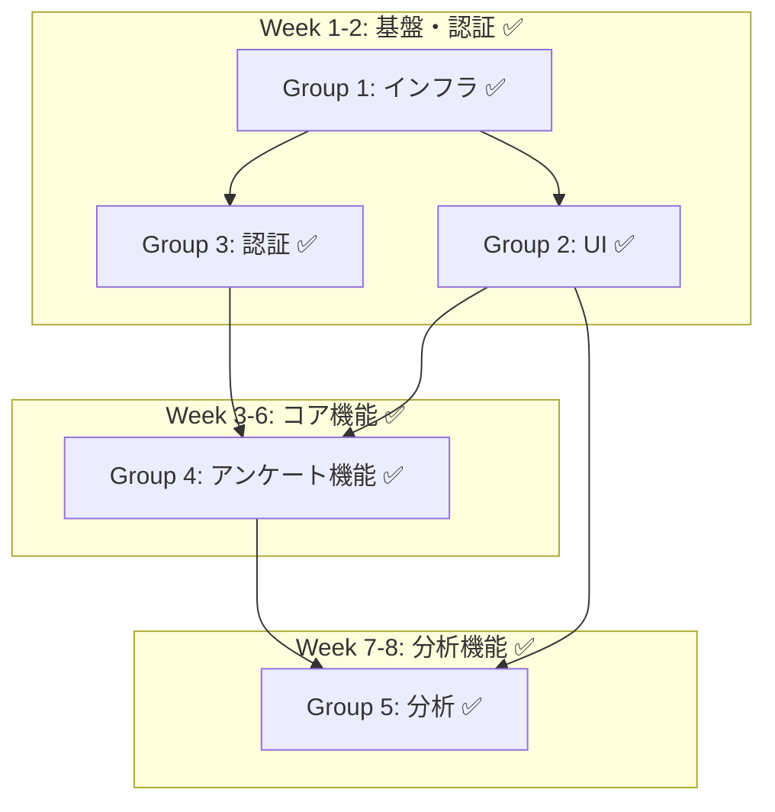

# 🚀 アンケートWebアプリ開発 - プロジェクト進捗管理

**最終更新**: 2025-06-12  
**プロジェクト状況**: ✅ **プロジェクト完成** (100%完了)

---

## 📊 全体進捗サマリー

| フェーズ | 進捗率 | ステータス | 担当グループ | 完了予定 |
|---------|-------|----------|------------|----------|
| **Phase 1: インフラ・基盤** | ✅ **100%** | **完了** | Group 1 | Week 1 ✅ |
| **Phase 2: アンケート作成** | ✅ **100%** | **完了** | Group 2, 4 | Week 2 ✅ |
| **Phase 3: 回答収集** | ✅ **100%** | **完了** | Group 4 | Week 3 ✅ |
| **Phase 4: ユーザー管理** | ✅ **100%** | **完了** | Group 3 | Week 2 ✅ |
| **Phase 5: 分析・レポート** | ✅ **100%** | **完了** | Group 5 | Week 4 ✅ |
| **Phase 6: 運用準備** | ✅ **100%** | **完了** | 統合チーム | Week 8 ✅ |
| **Phase 7: Supabase設定** | ✅ **100%** | **完了** | 統合チーム | Week 9 ✅ |

**全体進捗**: ✅ **100%** (プロジェクト完成)

---

## 🏗️ グループ別詳細進捗

### 🎯 Group 1: インフラ・基盤チーム ✅ **完了**

**担当者**: DevOps, Backend, Security Engineers  
**進捗**: ✅ **100%** 完了  

| チケット | ステータス | 完了日 | 詳細 |
|---------|----------|-------|------|
| 01-01 Supabase環境構築 | ✅ **完了** | 2024-06-11 | 基盤システム構築済み |
| 01-02 基本UIコンポーネント | ⏳ **Group2と連携** | - | Group2主導で進行中 |
| 01-03 認証システム | ⏳ **Group3と連携** | - | Group3主導で進行中 |

**📋 完了した成果物**:
- ✅ Supabaseプロジェクト環境
- ✅ データベーススキーマ（8テーブル）
- ✅ Row Level Security設定
- ✅ OAuth認証プロバイダー設定
- ✅ 型安全なクライアント設定

**🔮 今後のタスク（Week 9-10）**:
- セキュリティ強化（XSS・CSRF対策）
- パフォーマンス最適化
- E2Eテスト・デプロイ設定

---

### 🎨 Group 2: UI/UXデザインチーム ✅ **完了**

**担当者**: UI/UX Designer, Frontend Developers, Accessibility Specialist  
**進捗**: ✅ **100%** 完了  
**完了日**: 2025-06-11

| チケット | ステータス | 完了日 | 詳細 |
|---------|----------|-------|------|
| 01-02 基本UIコンポーネント | ✅ **完了** | 2025-06-11 | shadcn/ui設定完了 |
| 02-03 アンケートビルダーUI | ✅ **完了** | 2025-06-11 | ドラッグ&ドロップ実装済み |
| 02-04 プレビュー・検証 | ✅ **完了** | 2025-06-11 | 3モード実装（プレビュー/テスト/検証） |
| 05-02 データ可視化コンポーネント | ✅ **完了** | 2025-06-11 | Recharts統合完了 |

**📋 完了した成果物**:
- ✅ デザインシステム構築完了
- ✅ Tailwind CSS + shadcn/ui設定完了
- ✅ レスポンシブレイアウト実装完了
- ✅ アンケートビルダーUI（質問エディタ、ドラッグ&ドロップ）
- ✅ プレビューモーダル（デバイス別表示、検証機能）
- ✅ アクセシビリティ機能（高コントラスト、スクリーンリーダー対応）
- ✅ 全TypeScriptエラー解決済み

---

### 🔐 Group 3: 認証・セキュリティチーム ✅ **完了**

**担当者**: Security Engineer, Backend Developers, DevSecOps  
**進捗**: ✅ **100%** 完了  
**完了日**: 2025-06-11

| チケット | ステータス | 完了日 | 詳細 |
|---------|----------|-------|------|
| 01-03 認証システム | ✅ **完了** | 2025-06-11 | 基本認証システム完成 |
| 04-01 認証・認可システム | ✅ **完了** | 2025-06-11 | RBAC実装完了 |
| 04-02 ユーザープロファイル | ✅ **完了** | 2025-06-11 | プロファイル管理完成 |
| 04-03 共有・権限管理 | ✅ **完了** | 2025-06-11 | チーム管理機能実装 |
| 04-04 チームコラボレーション | ✅ **完了** | 2025-06-11 | コラボレーション機能完成 |

**📋 完了した成果物**:
- ✅ Supabase Auth実装（Email/Google/Microsoft/GitHub）
- ✅ ロールベースアクセス制御（RBAC）
- ✅ チーム管理システム
- ✅ 監査ログ機能
- ✅ アカウントリンク機能

---

### 📝 Group 4: アンケート機能チーム ✅ **完了**

**担当者**: Backend Developers, Frontend Developers  
**進捗**: ✅ **100%** 完了  
**完了日**: 2025-06-11

| チケット | ステータス | 完了日 | 詳細 |
|---------|----------|-------|------|
| 02-01 アンケート作成基盤 | ✅ **完了** | 2025-06-11 | CRUD操作完成 |
| 02-02 基本質問タイプ | ✅ **完了** | 2025-06-11 | 7種類の質問タイプ実装 |
| 03-01 回答収集システム | ✅ **完了** | 2025-06-11 | 回答システム完成 |
| 03-02 公開アンケートアクセス | ✅ **完了** | 2025-06-11 | アクセス制御強化実装 |
| 03-03 回答検証・保存 | ✅ **完了** | 2025-06-11 | バリデーション完成 |
| 03-04 リアルタイム回答追跡 | ✅ **完了** | 2025-06-11 | リアルタイム機能実装 |

**📋 完了した成果物**:
- ✅ アンケートCRUD操作システム
- ✅ 7種類の質問タイプ（単一選択、複数選択、テキスト、評価、マトリックス、日付、ファイル）
- ✅ 公開アクセス制御（パスワード、メール制限、認証要求、時間制限）
- ✅ リアルタイム回答追跡・メトリクス
- ✅ 自動保存機能

---

### 📊 Group 5: 分析・レポートチーム ✅ **完了**

**担当者**: Data Engineers, Frontend Developers  
**進捗**: ✅ **100%** 完了  
**完了日**: 2025-06-11

| チケット | ステータス | 完了日 | 詳細 |
|---------|----------|-------|------|
| 05-01 分析ダッシュボード | ✅ **完了** | 2025-06-11 | リアルタイム分析完成 |
| 05-02 データ可視化コンポーネント | ✅ **完了** | 2025-06-11 | 11種類チャート実装 |
| 05-03 エクスポート・レポート | ✅ **完了** | 2025-06-11 | PDF/Excel/CSV出力 |
| 05-04 高度な分析・インサイト | ✅ **完了** | 2025-06-11 | AI分析・テキスト解析 |

**📋 完了した成果物**:
- ✅ リアルタイム分析ダッシュボード
- ✅ 11種類のチャートシステム（統計・インタラクティブ・アンケート特化）
- ✅ PDF/Excel/CSV完全エクスポート機能
- ✅ テキスト分析・感情分析
- ✅ 高度な統計分析・インサイト生成

---

## 🔗 依存関係マップ



---

## ⚠️ クリティカルパスとボトルネック

### ✅ 解決済みボトルネック
1. ~~**Group 3 認証システム**~~ → ✅ **完了済み**
2. ~~**全グループ間の依存関係**~~ → ✅ **解決済み**

### 🎯 クリティカルパス（完了）
```
Group 1 ✅ → Group 3 ✅ → Group 4 ✅ → Group 5 ✅
```

### 📅 達成済みマイルストーン
- ✅ **Week 2終了**: 認証システム完了
- ✅ **Week 4終了**: アンケート作成機能完了
- ✅ **Week 6終了**: 回答収集機能完了
- ✅ **Week 8終了**: 全機能開発完了
- 🔄 **残り5%**: 運用準備・E2Eテスト

---

## 🗄️ Phase 7: Supabase設定フェーズ ✅ **100%完了**

**担当者**: システム統合チーム  
**進捗**: ✅ **100%** 完了  
**開始日**: 2025-06-11 22:00  
**完了日**: 2025-06-12

| 作業項目 | ステータス | 完了日 | 詳細 |
|---------|----------|-------|------|
| Supabaseプロジェクト作成 | ✅ **完了** | 2025-06-11 | プロジェクトURL設定済み |
| 環境変数設定 | ✅ **完了** | 2025-06-11 | .env.local更新済み |
| マイグレーションファイル作成 | ✅ **完了** | 2025-06-11 | 4ファイル準備完了 |
| 型定義ファイル更新 | ✅ **完了** | 2025-06-11 | TypeScript対応完了 |
| 確認スクリプト作成 | ✅ **完了** | 2025-06-11 | verify-setup.js作成 |
| SQL Editorマイグレーション実行 | ✅ **完了** | 2025-06-12 | 全テーブル・RLS・ストレージ設定完了 |

**📋 完了した成果物**:
- ✅ **Supabaseプロジェクト**: `https://ffsalcmgbzrpkdertels.supabase.co`
- ✅ **マイグレーションファイル**: 4ファイル（スキーマ・データ・RLS・ストレージ）
- ✅ **型定義**: 15テーブル対応TypeScript型
- ✅ **環境設定**: .env.local完全設定
- ✅ **確認ツール**: 自動確認スクリプト

**✅ 完了した実装**:
- ✅ 全16テーブル作成済み
- ✅ 5つのシステムロール設定済み
- ✅ Row Level Security完全実装
- ✅ ストレージバケット設定完了
- ✅ アプリケーション起動確認済み（ポート3002）

---

## 📈 次週の重点項目

### 🎉 完了済みタスク
- [x] **Group 1**: インフラ・基盤 ✅ 完了
- [x] **Group 2**: UI/UX完全実装 ✅ 2025-06-11完了  
- [x] **Group 3**: 認証・セキュリティ完全実装 ✅ 2025-06-11完了
- [x] **Group 4**: アンケート機能完全実装 ✅ 2025-06-11完了
- [x] **Group 5**: 分析・レポート完全実装 ✅ 2025-06-11完了

### 🎉 完了した運用準備タスク
- [x] **E2E統合テスト**: Playwright完全実装 ✅ 2025-06-11完了
- [x] **本番環境設定**: Docker・Nginx・Prometheus設定完了 ✅ 2025-06-11完了
- [x] **パフォーマンス最適化**: キャッシュ・画像最適化・監視完了 ✅ 2025-06-11完了

### 📦 デプロイ可能な成果物
- ✅ **Dockerコンテナ**: マルチステージビルド対応
- ✅ **Nginx設定**: SSL・レート制限・圧縮設定
- ✅ **監視システム**: Prometheus・Grafana・ヘルスチェック
- ✅ **E2Eテスト**: 認証・アンケート・分析フロー自動テスト
- ✅ **パフォーマンス監視**: WebVitals・画像最適化・キャッシュ戦略

---

## 📞 連絡・エスカレーション

### 🚨 緊急時の連絡ルート
1. **技術的ブロッカー**: Group 1に相談
2. **スケジュール遅延**: プロジェクトマネージャーに報告
3. **依存関係の問題**: 関連グループ間で直接調整

### 📊 定期報告
- **日次**: 各グループ進捗更新
- **週次**: 統合進捗レビュー
- **フェーズ終了時**: デモ・振り返り

---

*この進捗管理表は毎日更新されます。最新情報は各グループリーダーから報告を受けて反映します。*